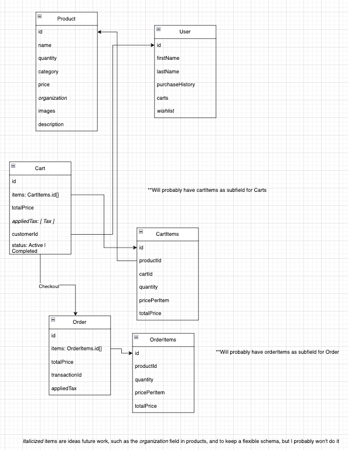

# Running Shop

E-commerce and strava-like community for runners

## Tech

### Frontend
1. React (Vite)
2. TailwindCSS
3. TypeScript

### Backend
1. NodeJS 
2. TypeScript
3. MongoDB

### Authentication

- JWT

### This was copied from my previous e2e_auth template repo

#### Goals:

1. Product Page
   - create backend CRUD
     - data model
     - seed a few products
     - 

2. Carts  
3. Checkout (no payments yet)
4. Orders page

Others;
- Unit tests pipeline

Work in progress:

### Todo's
"Tasks"
1.  ~~use github projects instead~~
- this project is tracked on github projects

#### Releases

#### Tech debt
- HMR on new files -- can this be achieved?
- Clean up the pages

#### Improvement ideas:
** (getting some ideas from lululemon website. will check other stores too)

- product list:
  -  ability to add to favorite
- /products/:productId:
  - select sizes
    - product sizes
      - each size has its own quantity/inventory
      - check inventory per store
  - suggestions ("you may also like...")
  - reviews
  - rating system
- gift cards

#### Other ideas:
- try adding openAI to PR reviews:
https://pretius.com/blog/open-ai-code-review/

